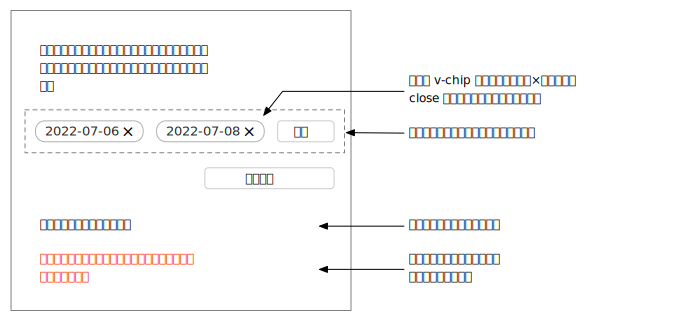

# フロントエンド課題

この度はファンファーレに興味を持って頂いてありがとうございます。フロントエンドのエンジニアに応募して頂いた方には Vue の基礎的な知識をお持ちかどうかを確認させて頂きたいため、課題を設定させて頂いています。

以下の説明をお読みの上、取り組んで下さい。

## 手順

1. 環境をセットアップする
2. 実装する
3. 送信する

### 環境をセットアップする

手続きを簡略化するため、オンラインの開発環境で取り組んで頂きます。具体的には、[CodeSandbox](https://codesandbox.io/) で実装して下さい。

ベースとなるコードはこのリポジトリのコードになりますので、[CodeSandbox](https://codesandbox.io/) の画面で `Create Sandbox` から `Import Project` を選択し、GitHub Repository URL の欄に `https://github.com/FanfareInc/frontend-assignment` を入力し、 `Import and Fork` をクリックしてプロジェクトをインポートして下さい。

インポートが成功すると、画面右側に画面が表示されているはずです。確認できたら、実装のフェーズに進んで下さい。

### 実装する

インポートしたプロジェクト内で実装を行って下さい。

#### ターミノロジー

- 排出事業者 = 産業廃棄物を排出する事業主体
- 現場 = 実際に産業廃棄物が発生する場所、建設現場など

#### ユースケース

- 排出事業者の現場担当者をユーザーとする
- ユーザーは複数の日付を候補として産業廃棄物の回収を産業廃棄物回収業者に依頼したい
  - 例えば「x 月 x 日、もしくは x 月 x 日に回収に来てください」というもの

#### 仕様

1. `pages/index.vue` でユーザーは複数の候補日（1 日でもよい）を登録できる
   - 「複数の日付を設定する」という行為は他でも発生する可能性が高いので、コンポーネントとして切り出し、ページ側からそれを利用するという構造にしてください
   - `追加` をクリックすると `v-date-picker` が表示され日付を選択できる
   - 日付が選択されたら、それは新しい候補日が追加されたと見なし `v-tip` を使って表示する
   - `v-tip` の `×` をクリックするとその日付が削除される
   - 日付が一つもない状態だと `依頼する` ボタンは `disabled` になる
     - `v-tip` が表示される場所はそのまま空欄で OK です
   - 本来は日付の数には制限を設ける可能性が高いですが、今回は候補数に制限はないものとします
2. `依頼する` ボタンを押すとサーバーにその日付が送信される
   - ボタンの表示には `v-btn` コンポーネントを利用して下さい（`loading` を利用したいためです）
   - サーバーには実際には接続せず、スタブのサーバークラスが用意されていますのでそちらを利用して下さい
     - `src/port.adapter/server-api/order.ts` を参照ください
   - 送信中になった場合、`v-btn` のプロパティの `loading` を `true` にし、ダブルクリックをできない様にして下さい
3. 依頼が正常に送信されると、ボタン以下に「回収の依頼が完了しました。」が表示される。
   - 入力した日付がリセットされる必要はない
   - ボタンが `disabled` になる必要はない
4. 送信が失敗すると、ボタン以下に「回収の依頼が失敗しました。時間をおいて再度試してください。」が表示される
   - 入力した日付がリセットされる必要はない
   - ボタンが `disabled` になる必要はない
   - テキストの色は `#ff0000` としてください
   - （文言が不親切という話はありそうですがそこは今回は本筋ではないので気にしないでください）

#### 実装上の注意

- `v-tip` や `v-date-picker` は Vuetify のコンポーネントです。仕様や使い方については以下を参照して下さい。なお、このプロジェクトでは既に利用できる状態にセットアップされていますので、追加で設定する必要はありません。
  - [コンポーネント説明](https://vuetifyjs.com/ja/components/chips/)
  - [API 説明](https://vuetifyjs.com/ja/api/v-chip/)
- スタブのサーバーは一定確率で送信が成功したり失敗したりしますので、両方のパターンに対応して下さい
- Vuex は利用するほど複雑ではありませんので利用しなくて構いません
- スタイルに関しては以下の方針として下さい
  - マルチクラスの BEM を前提とします
    - 本プロジェクトでは Vuetify を利用しており、弊社プロダクトでも Vuetify を利用しているためです
  - エレメントにはプレフィックスとして `__` を付ける
    - 例 `foo__bar`
    - エレメントがエレメントを内包する事は BEM 的には禁止でこのプロジェクトでも推奨はしないものの、Vuetify は許容しているので許容します
  - 状態を定義する場合はプレフィックスとして `--` を付ける
    - 基本的にはマルチクラスの設計とし、状態を切り出して定義します
    - 例 `foo__bar--active`
    - 例 `foo__bar--state_baz` (`state==baz`)

#### 考慮しなくてよい事

1. サーバーとのインターフェース
   - スタブの実装がありますのでそちらを利用してください
   - リトライ、冪等性などを考慮する必要はありません
   - コンポーネントの基礎的な組み合わせができるかのみを評価します
2. 細かいレイアウト
   - 本番環境では当然レイアウトも配慮しますが基本的にはこの課題では見ません
   - ただし、例示している画像と明らかに違うレイアウトは避けて下さい
   - 数ピクセル違うといった差異は見ません

### 送信する

CodeSandbox の URL をお送り頂きます。`Share` ボタンから `Copy Sandbox Link` をクリックして URL をコピーし、以下のフォームからお送り下さい。なお、記述式の事前課題とセットになっています。

[https://forms.gle/2sAP9KEdn6TJrmm49](https://forms.gle/2sAP9KEdn6TJrmm49)
